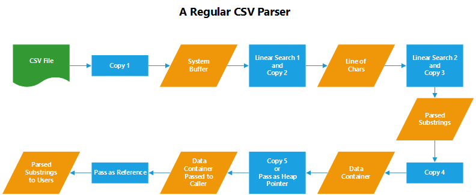
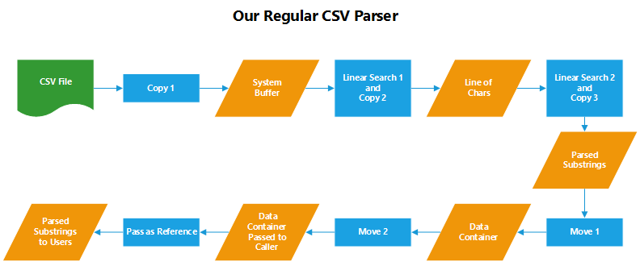
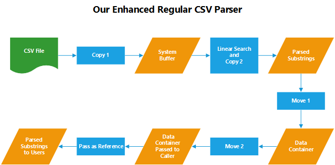
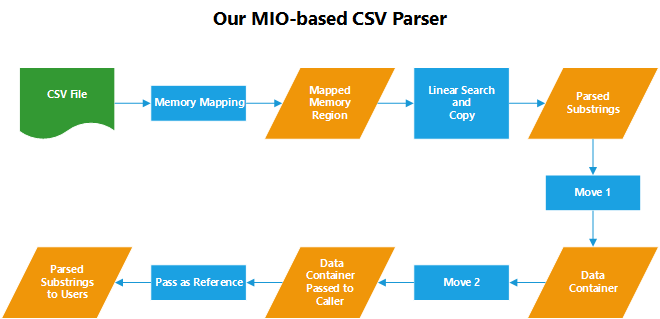

# MIOCSV

[](https://img.shields.io/badge/platform-Windows%20%7C%20macOS%20%7C%20Linux-red)

A [MIO](https://github.com/wxinix/wxlib/tree/main/mio)-bsased C++ library to read and write tabular data in CSV format. Our goal is to develop a suite of fast and easy-to-use CSV readers and writer similar to the [csv module](https://docs.python.org/3/library/csv.html#module-csv) from the Python standard library. It serves as our first step to rebuild [DTALite](https://github.com/asu-trans-ai-lab/DTALite) using modern C++.

## A Quick Tour
Four readers and one writer are provided along with two supporting data structures.

Facility | Functionality | Core | Dependency | Implementation
---------| --------------| -----| ---------- | ---------------
Reader | parse csv file line by line | std::istreambuf_iterator | C++11 | stdcsv.h
DictReader | parse csv file with headers line by line | std::istreambuf_iterator | C++11 | stdcsv.h
MIOReader | parse csv file line by line | memory mapping | stdcsv.h, mio.hpp,  and C++20 | miocsv.h
MIODictReader | parse csv file with headers line by line | memory mapping | stdcsv.h, mio.hpp, and C++20 | miocsv.h
Writer | write user's data to a local file | std::ofstream operator<< | C++11 | stdcsv.h
Row | store delimited strings or convert user’s data into strings | variadic template | C++11 | stdcsv.h
StringRange | define a string range by [head, tail] to facilitate string operations | template | C++11 | stdcsv.h

### Getting Started
***Use Reader***
```C++
#include "stdcsv.h"

#include <iostream>

int main()
{
    auto reader = miocsv::Reader {"regular.csv"};

    // use range-for loop to print out each line
    for (const auto& line: reader)
    {
        auto row_num = reader.get_row_num();
        std::cout << "line " << row_num  << ": " << line << '\n';

        // retrieve a record using index
        std::cout << "1st record: " << line[0] << "; "
                  << "2nd record: " << line[1] << '\n';
    }

    return 0;
}
```

***Use DictReader***
```C++
#include "stdcsv.h"

#include <iostream>

int main()
{
    auto reader = miocsv::DictReader {"regular.csv"};

    // print out headers
    std::cout << "headers are: " << reader.get_fieldnames() << '\n';

    // use range-for loop to print out each line
    for (const auto& line: reader)
    {
        auto row_num = reader.get_row_num();
        std::cout << "line " << row_num  << ": " << line << '\n';

        // for DictReader, we offer two ways to retrieve a record
        // 1st way, via index
        std::cout << "2nd record: " << line[1] << "; "
                  << "3rd record: " << line[2] << '\n';

        // 2nd way, via header
        std::cout << "link_id: " << line["link_id"] << "; "
                  << "facility_type: " << line["facility_type"] << '\n';
    }

    return 0;
}
```

***Use MIOReader***
```C++
// you would have to place mio/mio.hpp in your inclusion folder besides miocsv.h
#include "miocsv.h"

#include <iostream>

int main()
{
    auto reader = miocsv::MIOReader {"regular.csv"};

    for (const auto& line: reader)
    {
        auto row_num = reader.get_row_num();
        std::cout << "line " << row_num  << ": " << line << '\n';

        // similar to Reader, you can retrieve a record using index
        std::cout << "1st record: " << line[0] << "; "
                  << "2nd record: " << line[1] << '\n';
    }

    return 0;
}
```

***Use MIODictReader***
```C++
#include "miocsv.h"

#include <iostream>

int main()
{
    auto reader = miocsv::MIODictReader {"regular.csv"};

    std::cout << "headers are: " << reader.get_fieldnames() << '\n';

    for (const auto& line: reader)
    {
        auto row_num = reader.get_row_num();
        std::cout << "line " << row_num  << ": " << line << '\n';

        // similar to DictReader, you can retrieve a record using either index or header
        // via index
        std::cout << "2nd record: " << line[1] << "; "
                  << "3rd record: " << line[2] << '\n';

        // via header
        std::cout << "link_id: " << line["link_id"] << "; "
                  << "facility_type: " << line["facility_type"] << '\n';
    }

    return 0;
}
```

***Use Writer***
```C++
#include "stdcsv.h"

#include <iostream>

int main()
{
    auto writer = miocsv::Writer {"output.csv"};

    // there are two ways to construct a line
    // 1st way: construct a dedicate line using Row
    miocsv::Row r = {"1st way to write a record include string, int, and double",
                     "string", 1, 1.1};
    writer.write_row(r);

    // 2nd way: simply place a line into write_row()
    writer.write_row({"2nd way to write a record", "string", 2, 2.0});

    return 0;
}
```

### Exception Handlings

Consistency in number of records over rows (i.e., lines) is not enforced (see [RFC4180](https://www.rfc-editor.org/rfc/rfc4180.txt) for details). No warning or exception will be triggered unless it is one of the followings.

Facility \ Exception | Inconsistent Number of Records | InvalidRow[^1] | Empty Row | Row::operator[] Out of Range
---------------------| -------------------------------| ---------------| ----------|--------------
Reader | N/A | Warning | Preserve | Throw NoRecord[^2]
DictReader | Warning only if headers are more or less than records | Warning | Discard | Throw NoRecord[^3]
MIOReader | see Reader
MIODictReader | see DictReader

[^1]: Any value after quoted field is not allowed, which only applies to input with double quotes. A warning with detailed information will be printed out to help users inspect.
[^2]: It happens when retrieving a record by operator[] via index and index is out of range (negative or greater than the number of records).
[^3]: It complements NoRecord for Reader when retrieving a record by operator[] via header, i.e., an invalid header is given or a valid header is provided but there is no corresponding record (as a result of data inconsistency).

## Performance
### Time Bound at a Glance
The designed miocsv::MIOReader and miocsv::MIODictReader feature **Single Linear Search** and **One Copy Process** in parsing each line of a CSV file. Their time complexities are both _**O(2N)**_ in comparison with _**O(7N)**_ (or _**O(6N)**_) of a regular implementation discussed below, where _N_ is the number of chars in the file (including special chars, such as white space, delimiter, and line terminator). They are among the fastest CSV Parsers.

miocsv::Reader and miocsv::DictReader add one more copy process than their mio-based counterparts. Their running times are both bounded by _**O(3N)**_, which are still fast for most use cases.

Facility | Linear Search over Chars| Extensive Char Copy | Overall Time Complexity
:-------:| :----------------------:| :------------------:| :----------------------:
Reader | _O(N)_ | _O(2N)_ | _O(3N)_
DictReader | _O(N)_ | _O(2N)_ | _O(3N)_
MIOReader | _O(N)_ | _O(N)_ |_O(2N)_
MIODictReader | _O(N)_ | _O(N)_ |_O(2N)_

The reason we go with _N_ rather than _n_ in time bound expressions is to better differentiate with line terminator '\n'.

### Benchmarks

We conduct benchmark tests[^4] using a [data set](test/csvreader.csv) with 12 fields and 25,921 lines from [Queryverse](https://www.queryverse.org/benchmarks/). We time the average of five runs (in milliseconds) for each implementation including reader and DictReader from Python csv module as well.

Facility | Reader | DictReader | MIOReader | MIODictReader | Python csv.reader | Python csv.DictReader
:-------:| :-----:| :---------:| :-------: | :-----------: | :---------------: | :-------------------:
CPU Time (ms) | 37 | 38 | 23 | 26 | 37 | 124

[^4]: MacBook Pro (13-inch, 2020), CPU: Intel Core i5-1038NG7, RAM: 16GB 3733MHz LPDDR4X, Hard Drive: 512GB SSD, OS: Monterey 12.3.1, C++ Compiler: Apple clang 12.0.0, Python Interpreter: 3.7.6.

**Note that** the core of Python csv.reader is **Iterable**, which is a **C implementation**. csv.DictReader is built upon csv.reader with additional operations in setting up fieldnanes (headers) and linking fieldnames to fields (records) for each line, which are written in Python. It accounts for their performance difference.

Reader and DictReader can be implemented using std::getline() for simplicity, which implies a time bound of _**O(5N)**_ including two linear searches and three copy operations for each line. They are referred to as _Enhanced Regular CSV Parsers_ in the following section. For better comparison, we include their CPU times along with that from their core, std::getline().

Facility | Reader (_O(5N)_) | DictReader (_O(5N)_)| std::getline() |
:-------:| :---------------:| :------------------:| :------------: |
CPU Time (ms) | 44 | 44 | 16 |

### Under the Hood
Parsing a CSV file or a file of any other delimited formats is essentially a linear search over the source file (as a stream of chars) and extract strings separated by the delimiter(s).

How fast it can iterate over the source file char by char largely determines its overall performance. As it is an I/O constrained operation, there are two general ways to speed it up.

1. multithreading
2. memory mapping

As the underlying linear search in parsing indicates a sequential operation, **multithreading** might be moot and even cause contention problems unless there are independent partitions (see [mio::StringReader.getline_async()](https://github.com/wxinix/wxlib/blob/main/mio/include/mio/stringreader.hpp) for illustration).

**Memory mapping** is another and natural way to increase I/O performance, especially for large files, by reducing I/O data movement (i.e., copy) and enabling way faster access operations. It allows a process (e.g., our CSV parser) to access a file and directly incorporate file data into the process address space without copying the data itself into a data buffer (e.g., std::ifstream in C++).

#### Why Two Linear Searches?
A common and easy way to implement a CSV parser is by repeating the following two serial operations.

1. retrieve a line from the file
2. parse a line into a set of strings

Operation 1 iterates every each char and search for the line terminator while Operation 2 repeats the same process but rather looking for the delimiter over the same set of chars returned from Operation 1.

For a file with _N_ chars, this implementation involves two almost identical linear searches and implies a number of _O(2N)_ constant operations (in terms of comparison to these special chars). Why not combine them into one and reduce the operations into _O(N)_ times?  Even _O(2N)~O(N)_ in complexity analysis, their difference in CPU time cannot be ignored in this context. This can be achieved by introducing an iterator directly pointing to the stream of chars.
#### Copy Matters

There are several data copy operations going around with this implementation as illustrated by the following figure.



The last one can be avoided by passing the container as a pointer or a reference on the heap memory, e.g., [CSVparser](https://github.com/rsylvian/CSVparser). However, it might impose additional risk of memory leak.

C++11 introduced moving semantics, which can helps us bypass it as well as Copy 4 without the side effect.



Note that the string involved in Copy 2 and Copy 3 does nothing but only serves an intermediate media from buffered chars and the parsed substrings. Once its substrings are parsed, it becomes useless, and will be discarded while we are moving to the next line.

So why construct such a string object from the first beginning which only incurs unnecessary copy operation and additional cost on memory allocation? Why not pass its range as a pair of begin and end iterators which is equivalent but much more efficient (almost zero overhead)? To remove this copy operation, we can either build a customer string range type ([StringRange](https://github.com/jdlph/MIOCSV#a-quick-tour)) or simply adopt std::string_view (C++17). This will lead to the following enhanced implementation bounded by _**O(3N)**_, which is also the default implementation for Reader and DictReader.



With memory mapping presented before, the first copy operation is dropped as well. At this point, it leaves us with one and only one copy directly from chars in the file to the parsed substrings in conjunction with the single linear search, which indicates a tight time bound of _**O(2N)**_.



### Furthermore

As our design is to parse a CSV file line by line, a line along with its records will be discarded at this end of each iteration. Similar to the case on Copy 2 and Copy 3, we actually create and store strings which have only a temporary life cycle, and make unnecessary string copy operations (i.e., from chars to each parsed string). With memory mapping, the input file has been mapped to process memory. Therefore, we could store the range of a string rather than the string itself for later use. In other words, the aforementioned extensive copy can be reduced to a copy of std::string_view or our [StringRange](https://github.com/jdlph/MIOCSV#a-quick-tour), which is essentially a pair of pointers, and imposes almost zero overhead. For a file with _**C**_ fields and _**m**_ lines, it will reduce copy operations from _**O(N)**_ to _**O(mC)**_. This brings a refined overall time bound of _**O(N + mC)**_~_**O(N)**_, given _**mC << N**_ in most cases.

Even _**O(N)**_ is the best time bound over all possible CSV parser implementations, its underlying linear search over chars can be still improved by [AVX2 Intrinsics](https://www.intel.com/content/www/us/en/docs/intrinsics-guide/index.html). A perfect example is [mio::StringReader.fast_find()](https://github.com/wxinix/wxlib/blob/main/mio/include/mio/stringreader.hpp), which illustrates how to load 32 bytes into CPU registers and utilize some special flags to facilitate the search process.

## Acknowledgement
This project is inspired by two existing works from the community.
* [mio::StringReader.getline()](https://github.com/wxinix/wxlib/blob/main/mio/include/mio/stringreader.hpp). Thanks to Dr. Wuping Xin for making this master piece!
* The parsing algorithm from [CSVparser](https://github.com/rsylvian/CSVparser)[^5]. Thanks to its original author for this elegant procedure!

Besides, we would like to thank Dr. Wuping Xin for his valuable suggestions and comments towards this project, which lead to improvement in both its appearance and performance.

[^5]: We enhance it with support for double quotes, which are common in CSV files.